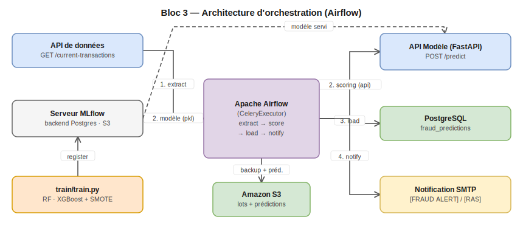
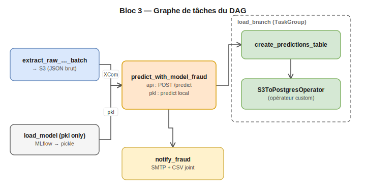

# Bloc 3 — Orchestration de pipelines de données (Apache Airflow)

**Livrable de certification**
Titre AIA — Architecte en Intelligence Artificielle
Bloc 3 — Conception et mise en œuvre de pipelines de données (Workflow Orchestration)
Auteur : **Ahmed Mehdi SEMAR**

---

## 1. Contexte et objectif

Ce dépôt démontre la conception et l'industrialisation d'un pipeline de données batch
sous **Apache Airflow**, appliqué à un cas de détection de fraude bancaire : extraction
de transactions, scoring par un modèle de classification, chargement des résultats en
base, et notification.

Deux variantes du même DAG sont fournies pour illustrer deux modes de service du
modèle, comparés à dessein :

- **`etl_fraud_batch_api_dag`** : le scoring appelle une API REST de serving (modèle
  hébergé séparément, cas type d'une architecture orientée microservices).
- **`etl_fraud_batch_pkl_dag`** : le modèle est récupéré depuis le Model Registry
  MLflow et désérialisé directement dans le worker Airflow (pas de dépendance réseau
  vers une API tierce pendant le scoring).

Le projet couvre l'ensemble de la chaîne : orchestration (Airflow), entraînement et
registry (MLflow), service du modèle (FastAPI), qualité et gestion des secrets
(Airflow Variables/Connections), supervision (logs Airflow, alerting par e-mail).

---

## 2. Architecture



> Source éditable : [`docs/diagrams/architecture.drawio`](docs/diagrams/architecture.drawio) (ouvrir avec [draw.io](https://app.diagrams.net)).

Les deux DAGs partagent la même structure en quatre étapes (extraction, scoring,
chargement, notification) ; seule la deuxième étape diffère selon que le modèle est
servi via une API ou exécuté localement.

---

## 3. Pile technique

- **Orchestration** : Apache Airflow 2.10.4 (CeleryExecutor), conteneurisé
- **Stockage intermédiaire** : Amazon S3 (lots bruts et prédictions)
- **Base cible** : PostgreSQL (table `fraud_predictions`)
- **Modèle** : scikit-learn (RandomForest) ou XGBoost, pipeline `imblearn`
  (suréchantillonnage SMOTE pour traiter le déséquilibre fraude/non-fraude)
- **Suivi & registry** : MLflow (backend Postgres, artifact store S3)
- **Service modèle** : FastAPI (variante API)
- **Notification** : e-mail SMTP (Gmail), avec pièce jointe CSV des prédictions

---

## 4. Structure du dépôt

```
bloc3_workflow_orchestration/
├── airflow_server/
│   ├── dags/
│   │   ├── etl_fraud_batch_dag_with_api.py   # DAG : scoring via API REST
│   │   ├── etl_fraud_batch_dag_with_pkl.py   # DAG : scoring via modele local
│   │   ├── tasks_with_api/
│   │   │   ├── extract_fraud.py              # appel API donnees + backup S3
│   │   │   ├── transform_predict_fraud.py    # feature engineering + appel API modele
│   │   │   └── notify_fraud.py               # notification SMTP
│   │   └── tasks_with_pkl/
│   │       ├── extract_fraud.py
│   │       ├── load_model_fraud.py           # charge le modele MLflow, le pickle localement
│   │       ├── transform_predict_fraud.py    # feature engineering + predict local
│   │       └── notify_fraud.py
│   ├── plugins/operators/
│   │   └── s3_to_postgres.py                 # operateur Airflow custom (S3 -> Postgres)
│   ├── docker-compose.yaml                   # stack Airflow complete (Celery)
│   ├── Dockerfile                            # image Airflow personnalisee
│   └── requirements.txt
├── api/
│   ├── app.py                                # API FastAPI de serving (/predict, /health)
│   ├── Dockerfile
│   └── requirements.txt
├── mlflow/
│   ├── Dockerfile                            # serveur MLflow Tracking
│   └── requirements.txt
└── train/
    ├── train.py                              # entrainement (RF/XGBoost + SMOTE)
    ├── MLProject                             # projet MLflow (exécution conteneurisee)
    └── docker/
        ├── Dockerfile
        └── requirements.txt
```

---

## 5. Le pipeline de données (DAGs)



> Source éditable : [`docs/diagrams/dag_flow.drawio`](docs/diagrams/dag_flow.drawio).

### 5.1 Schéma commun aux deux DAGs

1. **`extract_raw_transactions_batch`** — interroge l'API de données
   (`/current-transactions`) un nombre de fois paramétrable, sauvegarde le lot brut
   en JSON sur S3, transmet la clé S3 via XCom.
2. **Scoring** (diffère selon le DAG, voir 5.2) — reconstruit les features attendues
   par le modèle (extraction temporelle de l'heure, du jour de semaine, calcul de
   l'âge à partir de la date de naissance), produit les prédictions, sauvegarde un
   CSV de résultats sur S3.
3. **`load_branch`** (TaskGroup) — crée la table `fraud_predictions` si nécessaire
   (`SQLExecuteQueryOperator`) puis y charge le CSV de prédictions via l'opérateur
   custom `S3ToPostgresOperator`.
4. **`notify_fraud`** — envoie un e-mail récapitulatif (`[FRAUD ALERT]` si au moins
   une fraude détectée, `[RAS]` sinon), avec le CSV de prédictions en pièce jointe.

Les étapes 3 et 4 s'exécutent en parallèle, immédiatement après le scoring.

### 5.2 Différence entre les deux DAGs

| | `etl_fraud_batch_api_dag` | `etl_fraud_batch_pkl_dag` |
| --- | --- | --- |
| Scoring | Appel HTTP `POST /predict` par transaction | `mlflow.sklearn.load_model` puis `predict` local |
| Tâche additionnelle | — | `load_model` (téléchargement + pickle du modèle, en parallèle de l'extraction) |
| Dépendance réseau au scoring | API de serving | Aucune (modèle déjà chargé dans le worker) |
| Cas d'usage illustré | Architecture découplée (modèle = microservice indépendant) | Latence réduite, pas de dépendance à la disponibilité d'une API tierce |

### 5.3 L'opérateur custom `S3ToPostgresOperator`

Les opérateurs Postgres standards d'Airflow ne savent pas charger un fichier S3
directement. `plugins/operators/s3_to_postgres.py` comble cet écart : il télécharge
l'objet S3 via `S3Hook`, le charge en `DataFrame`, puis l'insère en base via
`PostgresHook.get_sqlalchemy_engine()` et `DataFrame.to_sql(..., if_exists="append")`.

### 5.4 Notification

`notify_fraud.py` envoie un e-mail SMTP (Gmail, `smtplib`) avec le récapitulatif du
batch et le CSV de prédictions en pièce jointe. Le paramètre `notify_on_no_fraud`
distingue deux usages : `True` en exécution batch (un mail à chaque run, alerte ou
RAS), `False` envisageable pour un usage unitaire/streaming (silence si aucune
fraude détectée).

---

## 6. Entraînement du modèle (`train/`)

`train.py` entraîne un modèle de détection de fraude sur le jeu de données public
de transactions, avec :

- **Feature engineering** : extraction de l'heure et du jour de la semaine depuis
  l'horodatage de transaction, calcul de l'âge du titulaire à la date de la
  transaction ; suppression des colonnes identifiantes ou à cardinalité trop élevée
  (numéro de carte, nom, adresse, numéro de transaction).
- **Split stratifié** train/test (80/20), nécessaire vu le déséquilibre marqué de
  la fraude dans le jeu de données.
- **Gestion du déséquilibre** : pipeline `imblearn` avec **SMOTE**, appliqué après
  le preprocessing et avant le classifieur (le suréchantillonnage ne doit porter
  que sur le train, jamais sur le test — propriété garantie par `imblearn.Pipeline`).
- **Choix du modèle paramétrable en CLI** : `--model_type random_forest|xgboost`,
  `--n_estimators`, `--max_depth`.
- **Métriques de test** loggées dans MLflow : precision, recall, F1,
  `classification_report` complet.
- **Enregistrement** dans le Model Registry MLflow (`fraud_detection`), alias
  `challenger` posé automatiquement sur la version entraînée.

```bash
cd train
pip install -r docker/requirements.txt
python train.py --model_type random_forest --n_estimators 200 --max_depth 8
```

`MLProject` permet une exécution conteneurisée via MLflow Projects
(`mlflow run train --docker-args ...`) ; l'image de référence et les variables
d'environnement transmises au conteneur y sont déclarées.

---

## 7. Mise en route

### 7.0 Prérequis

- Docker et Docker Compose
- Un bucket **S3** et une paire de clés IAM
- Un compte e-mail Gmail avec un **mot de passe d'application** (pour `smtplib`)
- Un serveur MLflow Tracking accessible (déployé via `mlflow/`, ou réutilisé depuis
  un autre dépôt du projet)

### 7.1 Démarrer la stack Airflow

```bash
cd airflow_server
docker compose up airflow-init
docker compose up -d
```

La stack `docker-compose.yaml` provisionne Postgres (métadonnées Airflow), Redis
(broker Celery), le webserver, le scheduler, un worker, le triggerer, et
optionnellement Flower (profil dédié). L'interface est disponible sur
`http://localhost:8080`.

### 7.2 Configurer les Connections et Variables Airflow

Les DAGs ne contiennent aucun secret en dur ; tout passe par les **Connections**
(`aws_default`, `postgres_default`) et les **Variables** Airflow, à renseigner dans
l'UI (Admin → Connections / Variables) ou via la CLI `airflow variables set`.

**Connections**

| Connection ID | Type | Contenu |
| --- | --- | --- |
| `aws_default` | Amazon Web Services | Clé d'accès / secret IAM, région |
| `postgres_default` | Postgres | Hôte, port, base, utilisateur, mot de passe |

**Variables**

| Variable | Rôle |
| --- | --- |
| `S3BucketName` | Bucket S3 utilisé pour les lots bruts et les prédictions |
| `FRAUD_BASE_URL` / `FRAUD_ENDPOINT` | URL de l'API de données |
| `FRAUD_BATCH_SIZE` / `FRAUD_SLEEP_SECONDS` | Taille du lot extrait, pause entre appels |
| `FRAUD_S3_PREFIX` / `FRAUD_S3_PRED_PREFIX` | Préfixes S3 (lots bruts / prédictions) |
| `FRAUD_MODEL_API_BASE_URL` / `FRAUD_MODEL_API_PREDICT_ENDPOINT` | URL de l'API modèle (DAG `api` uniquement) |
| `FRAUD_MODEL_API_TIMEOUT` | Timeout des appels au modèle |
| `MLFLOW_TRACKING_URI` | URL du serveur MLflow (DAG `pkl` uniquement) |
| `REGISTERED_MODEL_NAME` / `ALIAS` | Nom du modèle et alias à charger (DAG `pkl` uniquement) |
| `SMTP_SENDER_EMAIL` / `SMTP_APP_PASSWORD` / `SMTP_RECEIVER_EMAIL` | Notification e-mail |
| `SMTP_HOST` / `SMTP_PORT` | Optionnel, défauts Gmail (`smtp.gmail.com`, `587`) |

### 7.3 Déployer le serveur MLflow et entraîner un modèle

Voir section 6. Une fois le modèle enregistré sous l'alias `challenger`, déplacer
l'alias vers la version souhaitée (`production` ou `challenger`, selon la
convention retenue côté Variable `ALIAS`) avant de déclencher le DAG `pkl`.

### 7.4 Déployer l'API du modèle (DAG `api` uniquement)

```bash
cd api
docker build -t fraud-detection-api .
docker run --rm -p 7860:7860 --env-file .env fraud-detection-api
```

`GET /health` confirme le chargement effectif du modèle avant tout appel à
`POST /predict`.

### 7.5 Déclencher un DAG

Depuis l'UI Airflow (`http://localhost:8080`), activer puis déclencher
`etl_fraud_batch_api_dag` ou `etl_fraud_batch_pkl_dag` (`schedule=None` : les deux
DAGs sont prévus pour un déclenchement manuel ou par un trigger externe).

---

## 8. Qualité, sécurité et supervision

- **Secrets** : aucun identifiant en dur dans le code ; tout passe par les
  Connections/Variables Airflow (chiffrées dans la base de métadonnées via la
  `Fernet key`) ou les fichiers `.env` non versionnés.
- **Résilience** : chaque tâche définit `retries=1` et `retry_delay=1 minute`
  (`default_args` du DAG) ; les échecs individuels de prédiction (ligne par ligne,
  DAG `api`) sont capturés et ne font pas échouer tout le batch.
- **Traçabilité** : chaque étape transmet ses identifiants (clé S3, compteurs) via
  XCom, consultable dans l'UI Airflow pour chaque run ; les paramètres et métriques
  d'entraînement sont tracés dans MLflow (data lineage modèle).
- **Supervision** : logs détaillés par tâche dans l'UI Airflow ; alerting fonctionnel
  par e-mail à l'issue de chaque batch, avec distinction explicite fraude détectée /
  RAS.

---

## 9. Limites connues et évolutions

- Les deux DAGs sont déclenchés manuellement (`schedule=None`) ; un passage en
  planification récurrente (`schedule_interval`) est immédiat à activer mais
  volontairement laissé en mode démonstration pour ce livrable.
- Le choix entre les deux variantes de scoring (API vs modèle local) reste manuel ;
  un routage dynamique (bascule automatique vers le modèle local en cas
  d'indisponibilité de l'API) est une évolution possible.

---

## Auteur

**Ahmed Mehdi SEMAR** — Livrable Bloc 3 (Workflow Orchestration), certification
AIA — Architecte en Intelligence Artificielle.
